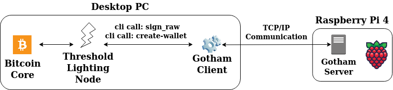

# A modified implementation of Core Lightning (c-lightning) that implements 2-party threshold ECDSA for the first time.

The implementation was done by [Omer Shlomovits][omer] and [me][ahmet] as part of my Ph.D. research.

`hsmd` and `bitcoin` modules were modified to incorporate the threshold code into the Core Lightning software.

To perform the 2-party threshold operations, [gotham-city][gotham] from ZenGo was used. However, we slightly modified it to our needs.

The work resulted in 2 publications: [WiSec '21 paper][wisec] and [arXiv preprint][arxiv] (currently in-review).


* [Overall Architecture](#overall-architecture)
* [Installation Steps for Desktop PC](#installation-steps-for-desktop-pc)
    * [Bitcoin Core](#bitcoin-core)
    * [Core Lightning](#core-lightning)
    * [Gotham Client](#gotham-client)
* [Installation Steps for Raspberry Pi](#installation-steps-for-raspberry-pi)
    * [Gotham Server](#gotham-server)


## Overall Architecture:

 

Essentially, we split a Lightning node into two using threshold cryptography. All Lightning operations such as opening a channel, sending a payment, receiving a payment, and closing a channel are performed jointly between two parties. This seperation is useful for the following scenarios:
 - Improve Lightning node's security by adding another user that acts as a signer.
 - Enable a resource constrained device to use Lightning trustlessly through another node.

For our implementation, we chose to use a Raspberry Pi 4 as the signer (or resource constrained device). A desktop PC runs the Gotham Client along with the Lightning Node. Lightning node makes cli calls to the Gotham Client whenever a signing operation is needed. Then, Gotham Client communicates with Gotham Server which runs on the Raspberry Pi to perform any threshold operation.


## Installation Steps for Desktop PC

**The implementation was tested on a fresh Ubuntu 16.04.7 installation.**

### Bitcoin Core

Install Bitcoin Core first which is now available via snapd:
```bash
sudo apt install snapd
sudo snap install bitcoin-core --channel=24.x/stable
sudo ln -s /snap/bitcoin-core/current/bin/bitcoin{d,-cli} /usr/local/bin/
```

Create a config file for Bitcoin Core:
```bash
mkdir ~/.bitcoin
touch ~/.bitcoin/bitcoin.conf
```

paste the following into `bitcoin.conf`:
```bash
server=1
testnet=1
daemon=1
```

run Bitcoin Core:
```bash
bitcoind &
```

check regularly to see if Bitcoin is synched with Bitcoin [Testnet block height][testnet]:
```bash
bitcoin-cli getblockcount
```

Now we are done with configuring Bitcoin. Moving onto Core Lightning part.

### Core Lightning

Get dependencies:
```bash
sudo apt update
sudo apt install -y \
  autoconf automake build-essential git libtool libgmp-dev \
  libsqlite3-dev python3 python3-mako net-tools zlib1g-dev libsodium-dev \
  gettext
```

Clone this repository:
```bash
cd ~
git clone https://github.com/startimeahmet/lightning.git
```

Build Core Lightning:
```bash
cd ~/lightning
./configure
make
sudo make install
```

Create a config file for Core Lightning:
```bash
mkdir ~/.lightning
touch ~/.lightning/config
```

Paste the following into `config` file you just created:
```
network=testnet
log-level=debug
```

You can now run Core Lightning:
```bash
lightningd &
```

Wait before doing anything with the Lightning node, because you need to set up Gotham Client first.

### Gotham Client

Gotham Client is run on the desktop machine and used by the Lightning node for threshold operations.

Get dependencies:
```bash
sudo apt install libssl-dev clang libgmp3-dev curl
```

Install Rust Toolchain:
```bash
curl --proto '=https' --tlsv1.2 -sSf https://sh.rustup.rs | sh
rustup default nightly-2020-08-27
source "$HOME/.cargo/env"
```

Clone the repo and switch to `cyclic-dependency` branch:
```bash
cd ~
git clone https://github.com/startimeahmet/gotham-city
cd gotham-city
git checkout cyclic-dependency
```

Then compile Gotham Client:
```bash
cd ~/gotham-city/gotham-client
cargo build --release
```

Finally, modify the first line in `Settings.toml` file inside Gotham Client folder.
```bash
nano ~/gotham-city/gotham-client/Settings.toml
```

Here, for endpoint, you need to enter the IP address and the port number of the Gotham Server. 
```
endpoint = "http://localhost:8000"
```

## Installation Steps For Raspberry Pi

### Gotham Server 

Raspberry Pi only runs the Gotham Server to join in threshold operations.

After installing a fresh Raspbian on the Pi, first install the dependencies:
```bash
sudo apt install libssl-dev clang libgmp3-dev git
```

Install Rust Toolchain:
```bash
curl --proto '=https' --tlsv1.2 -sSf https://sh.rustup.rs | sh
rustup default nightly-2020-08-27
source "$HOME/.cargo/env"
```

Clone the repo and switch to `cyclic-dependency` branch:
```bash
cd ~
git clone https://github.com/startimeahmet/gotham-city
cd gotham-city
git checkout cyclic-dependency
```

Compile Gotham Server:
```bash
cd ~/gotham-city/gotham-server
cargo build --release
```

Find the IP address of the Pi that Gotham Server will use:
```bash
ifconfig
```

After determining the IP (and the port), modify the `Rocket.toml` file inside Gotham Server folder:
```bash
nano ~/gotham-city/gotham-server/Rocket.toml
```

Here, for `port` and `address`, you need to enter the IP address and the port number you found earlier. 
```
[production]
address = "localhost"
port = 8000
keep_alive = 5
log = "normal"
```

Finally, run the Gotham Server:
```bash
cargo run --release
```

[gotham]: https://github.com/ZenGo-X/gotham-city
[omer]: https://www.omershlomovits.com/
[ahmet]: https://www.linkedin.com/in/ahmet-kurt-fiu/
[gotham-ahmet]: https://github.com/startimeahmet/gotham-city/tree/cyclic-dependency
[testnet]: https://blockstream.info/testnet/
[wisec]: https://doi.org/10.1145/3448300.3467833
[arxiv]: https://arxiv.org/abs/2206.02248